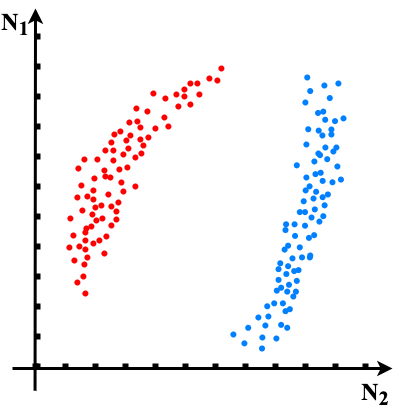
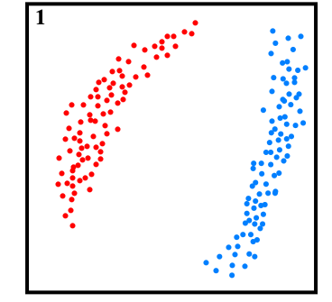
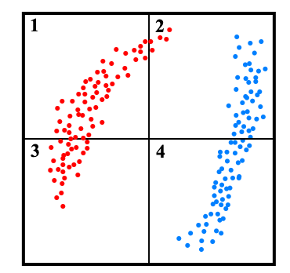
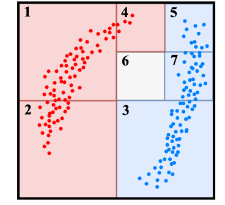

  
   
  <b>Санкт-Петербургский государственный политехнический университет</b>
   
  <b>Институт компьютерных наук и технологий</b>
   
  <b>Высшая школа программной инженерии</b>

 
 
 
 

<b>编码单元分类器</b> 

 
 
 
 
 
 

| Выполнил студенты гр. 3530904/90102 | Мэн Ц.            |
| :---------------------------------- | ----------------- |
| Руководитель                        | Черноруцкий И. Г. |

 
 

  
Санкт-Петербург

  
2023

> 作者：孟嘉宁，圣彼得堡彼得大帝理工大学，计算机科学与技术学院
>
> Мэн Цзянин, Санкт-Петербургский политехнический университет Петра Великого, Институт компьютерных наук и технологий
>

<b>摘要</b> 

> 关键词：机器学习，分类算法，分类器，分类预测，监督学习，算法，编码单元

本文提出了一种新的算法 (CUCL - Coding unit classification algorithm), 用于解决机器学习中的分类预测问题。CUCL 的灵感来自于**高效率视讯编码[^1-1]**（High Efficiency Video Coding，简称 HEVC，又称为H.265）中的[编码树单元](https://zh.wikipedia.org/wiki/編碼樹單元)(Coding Tree Unit, CTU)。

编码树单元是HEVC的基本编码单元。HEVC支援8x8到64×64像素的CTU大小。编码树单元取代了过往中使用的 16×16 像素[宏区块](https://zh.wikipedia.org/wiki/宏區塊)，编码树单元可使用 64×64 的大区块结构，且可以更好地将图片细分为可变大小尺寸。于初始时将图片划分为编码树单元，可以为64×64、32×32或16×16，而像素块尺寸提升通常会提高时编码的效率。

借助于编码树中编码单元的思想，我们开发了编码单元分类分类器（Coding unit classifier， CUC），此外我们还提出了一种新的方法，用于识别和消除数据集中的异常值。

在本项工作中，使用了 scikit-learn 库，并且将 PyCharm 和 Visual Studio Code 作为开发环境。开发语言为 Python3。

*在最终结果中将对一些数据集进行实验研究*，以验证我们提出的算法的性能。我们在配备了 macOS13 平台的设备上进行了所有的实验研究，该平台采用64位操作系统，Apple M1 Pro 8 核心CPU，以及统一内存架构的16GB内存。

[toc]

# 简介

机器学习是人工智能的一个分支。人工智能的研究历史有着一条从以“推理”为重点，到以“知识”为重点，再到以“学习”为重点的自然、清晰的脉络。显然，机器学习是实现人工智能的一个途径，即以机器学习为手段解决人工智能中的问题。机器学习在近30多年已发展为一门多领域交叉学科，涉及概率论、统计学、逼近论、凸分析、计算复杂性理论等多门学科。机器学习理论主要是设计和分析一些让计算机可以自动“学习”的算法。机器学习算法是一类从数据中自动分析获得规律，并利用规律对未知数据进行预测的算法。因为学习算法中涉及了大量的统计学理论，机器学习与推断统计学联系尤为密切，也被称为统计学习理论。算法设计方面，机器学习理论关注可以实现的，行之有效的学习算法。很多推论问题属于无程序可循难度，所以部分的机器学习研究是开发容易处理的近似算法。[^1-2]

机器学习已广泛应用于数据挖掘、计算机视觉、自然语言处理、生物特征识别、搜索引擎、医学诊断、检测信用卡欺诈、证券市场分析、DNA序列测序、语音和手写识别、游戏和机器人等领域。

**机器学习可以分成下面几种类别：**

- 监督学习从给定的训练数据集中学习出一个函数，当新的数据到来时，可以根据这个函数预测结果。监督学习的训练集要求是包括输入和输出，也可以说是特征和目标。训练集中的目标是由人标注的。常见的监督学习算法包括回归分析和统计分类。

    监督学习和非监督学习的差别就是训练集目标是否有人为标注。他们都有训练集 且都有输入和输出

- 无监督学习与监督学习相比，训练集没有人为标注的结果。常见的无监督学习算法有生成对抗网络（GAN）、聚类。

- 半监督学习介于监督学习与无监督学习之间。

- 增强学习机器为了达成目标，随着环境的变动，而逐步调整其行为，并评估每一个行动之后所到的回馈是正向的或负向的。

许多算法被提出用于解决机器学习中的分类预测问题，并取得了较好的结果（T.Cover, P.Hart, 1967[^1-3]; Harry Zhang, 2004[^1-4]; Kevin P. Murphy, 2006[^1-5]; Leo Breiman, 1984[^2-5]; Quinlan, J. R. 1986[^2-6]; Quinlan, J. R. 1993[^2-7]; Freund, Y., Mason, L. 1999[^2-9]; Tin Kam Ho, 1995[^2-11], Leo Breiman, 2001[^2-12]; David Cox, 1958[^2-22]; V.N. Vapnik，A.Y. Chervonenkis，C. Cortes等人, (1964)[^2-14]）。下一章将讨论其中的一些算法。

# 文献回顾

在介绍本文中提出的算法之前，我们将介绍以前为解决计机器学习分类预测方面所做的一些工作。

- 1967年，T.M.COVER和P.E.HART提出了kNN算法(k-NearestNeighbor, kNN)[^1-2]。其中k指的是某个样本的k个最近的邻居，也就是说每个样本都可以用它最接近的k个邻居来代表或预测。 kNN算法的核心思想是如果一个样本在特征空间中的k个最相邻的样本中的大多数属于某一个类别，则该样本也属于这个类别，并具有这个类别上样本的特性。该方法在确定分类决策上只依据最邻近的一个或者几个样本的类别来决定待分样本所属的类别。

    > https://bbs.huaweicloud.com/blogs/251434
    
    

- 在（Harry Zhang, 2004[^1-3]; Kevin P. Murphy, 2006[^1-4]）中提出了朴素贝叶斯分类器。该分类器模型会给问题实例分配用特征值表示的类标签，类标签取自有限集合。它不是训练这种分类器的单一算法，而是一系列基于相同原理的算法：所有朴素贝叶斯分类器都假定样本每个特征与其他特征都不相关。朴素贝叶斯自1950年代已广泛研究，在1960年代初就以另外一个名称引入到文本信息检索界中[^2-1]，并至今仍然是文本分类的一种热门方法，文本分类是以词频为特征判断文件所属类别或其他（如垃圾邮件、合法性、体育或政治等等）的问题。通过适当的预处理，它可以与这个领域更先进的方法（包括支持向量机）相竞争。它在自动医疗诊断中也有应用。

    
  
- 决策树 - 决策树是一类树模型的统称，其最早可以追溯到1948年左右，当时克劳德·香农介绍了信息论[^2-2]，这是决策树学习的理论基础之一。随后，1963年，Morgan和Sonquist开发出第一个回归树[^2-3]，他们提出了一种分析调查数据的方法，它不对交互影响施加任何限制，侧重于减少预测误差，顺序操作，并且不依赖于分类中的线性程度或解释变量的排列顺序，当时他们起名为交互检测（AID）模型。由于AID没有真正考虑到数据固有的抽样变异性，Messenger和Mandell在1972提出了THAID树以弥补这一缺陷，1980年，Gordon V. Kass开发出CHAID算法[^2-4]，这是AID和THAID程序的正式扩展。

    随后出现的是CART树——分类和回归树（简称CART）——是Leo Breiman引入的术语[^2-5]，指用来解决分类或回归预测建模问题的决策树算法。CART模型包括选择输入变量和那些变量上的分割点，直到创建出适当的树。使用贪婪算法（greedy algorithm）选择使用哪个输入变量和分割点，以使成本函数（cost function）最小化。

    1986年，Quinlan开发出ID3算法[^2-6]，并于随后几年提出了C4.5算法[^2-7]。之后为了提高它的运算效率，Loh和Shih于1997年开发出QUEST[^2-8]。

    1999年，Yoav Freund和Llew Mason提出AD-Tree[^2-9]，在此之前，决策树已经在正确率上取得了很不错的成就，但是当时的决策树在结构上依旧太大，而且不容易理解，所以AD-Tree在节点上做了改变。该算法不仅对数进行投票，也对决策节点进行投票。并且每个决策节点都是有语义信息的，支持图形化，使人更容易理解。

    目前流行的决策树算法包括ID3、CHAID、CART、QUEST和C4.5。

    决策树可以看成为一个if-then规则的集合，即由决策树的根节点到叶节点的每一条路径构建一条规则，路径上内部节点的特征对应着规则的条件，而叶节点的类对应于规则的结论。因此决策树就可以看作由条件if（内部节点）和满足条件下对应的规则then（边）组成。

    决策树的工作方式是以一种贪婪（greedy）的方式迭代式地将数据分成不同的子集。其中回归树（regression tree）的目的是最小化所有子集中的MSE（均方误差）或MAE（平均绝对误差）；而分类树（classification tree）则是对数据进行分割，以使得所得到的子集的熵或基尼不纯度（Gini impurity）最小。[^2-10]
    
    
    
- Tin Kam Ho 于 1995 年[^2-11]提出了随机森林。随后由Leo Breiman于2001年[^2-12]在一篇论文中提出了一种结合随机节点优化和bagging，利用类CART过程构建不相关树的森林的方法。此外，本文还结合了一些已知的、新颖的、构成了现代随机森林实践的基础成分，特别是

    1. 使用out-of-bag误差来代替泛化误差
    2. 通过排列度量变量的重要性

    随机森林也是集成学习方法的一种。在机器学习中，随机森林是一个包含多个决策树的分类器，并且其输出的类别是由个别树输出的类别的众数而定。RF 模型已被证明是小样本和高维数据的可靠预测器（Biau 和 Scornet，2016[^2-13]）。

- 逻辑回归分类器 (Logistic regression, LR) 是另一种基本方法,虽然名字中带有“回归”一次，但它是一个分类器而不是回归方法，最初由David Cox在1958年提出[^2-22]，它建立了一个Logistic模型（也被称为Logit模型）。它最显著的优点是，它既可以用于分类，也可以用于类别概率估计，因为它与对数数据分布相联系。它采取线性组合的特征，并对其应用非线性的sigmoid函数。在逻辑回归的基本版本中，输出变量是二进制的，然而，它可以扩展到多个类别（那么它被称为多进制逻辑回归(multinomial logistic regression)）。二元逻辑模型将样本分为两类，而多指标逻辑模型则将其扩展为任意数量的类，而不对其进行排序。[^2-23]

    

- 支持向量机（Support Vector Machine, SVM）被V.N. Vapnik，A.Y. Chervonenkis，C. Cortes 等人于 1964 年[^2-14]提出，1964年，Vapnik和Alexey Y. Chervonenkis对广义肖像算法进行了进一步讨论并建立了硬边距的线性SVM[^2-15]。此后在二十世纪70-80年代，随着模式识别中最大边距决策边界的理论研究[^2-16]、基于松弛变量（slack variable）的规划问题求解技术的出现[^2-17]，和VC维（Vapnik-Chervonenkis dimension, VC dimension）的提出[^2-18]，SVM被逐步理论化并成为统计学习理论的一部分。1992年，Bernhard E. Boser、Isabelle M. Guyon和Vapnik通过核方法得到了非线性SVM[^2-19]。1995年，Corinna Cortes和Vapnik提出了软边距的非线性SVM并将其应用于手写字符识别问题 [^2-20]。

    SVM 是一类按监督学习方式对数据进行二元分类的广义线性分类器（generalized linear classifier），其决策边界是对学习样本求解的最大边距超平面（maximum-margin hyperplane）[^2-21]。SVM 使用铰链损失函数（hinge loss）计算经验风险（empirical risk）并在求解系统中加入了正则化项以优化结构风险（structural risk），是一个具有稀疏性和稳健性的分类器。SVM可以通过核方法（kernel method）进行非线性分类，是常见的核学习（kernel learning）方法之一。

# 所提出的方法

> class 中所应包含的函数和成员
>
> 成员：
>
> | 成员         | 说明                                                         |
> | ------------ | ------------------------------------------------------------ |
> | source_v_max | 归一化或者标准化之前数据集中的最大值（该数据应该在数据预处理时进行记录） |
> | source_v_min | 归一化或者标准化之前数据集中的最大值（该数据应该在数据预处理时进行记录） |
> |              |                                                              |
>
> 参数：
>
> | 参数   | 说明 |
> | ------ | ---- |
> | 归一化 |      |
> | 标准化 |      |
> |        |      |
>
> 

## 模型中使用的变量和参数

| **变量/参数** | **定义** |
| ------------- | -------- |
|               |          |
|               |          |
|               |          |
|               |          |
|               |          |
|               |          |
|               |          |
|               |          |
|               |          |

## 数据预处理

在得到特征抽取之后的数据集之后，我们要对数据集中的数据进行预处理。在本文提出的分类器 CUC 中，数据预处理的引入是为了方便后续数据可视化和消除当数据集维度过大时可能造成的计算数据溢出。可以使用归一化和标准化两种方式，这两种方式也是大部分机器学习算法中所常使用的方法。

### 归一化

在归一化中我们将特征抽取之后的数据进行变换，把数据映射到固定区间$[I_{min}, I_{max}]$之内。归一化的在数学上表述如下：
$$
x^{\prime}={\frac{x-x_{min}}{x_{max}-x_{min}}} \cdot {(I_{max}-I_{min})}+I_{min}
$$
其中，

- $x$ - 为数据集中的当前元素
- $x_{min}$ - 为数据集中最小的元素
- $x_{max}$ - 数据集中最大的元素
- $I_{min}$ - 指定区间值的最小值
- $I_{max}$ - 指定区间值的最大值

进行归一化的优点是未改变数据分布的形状，但缺点是如果出现缺失值或者异常值（最大值和最小值是一个非常大的数），归一化会非常收到异常点的影响。所以这种方法的鲁棒性较差。

### 标准化

> https://www.zhihu.com/question/46500878

标准化（Standardization）也叫 Z 值归一化（Z-Score Normalization），它的作用是将每一维特征都调整为均值为 0，方差为 1。如果数据集中的数据较为嘈杂，我们应该使用标准化来对数据集中的数据进行特征预处理。标准化的在数学上表述如下：

首先计算均值与方差
$$
\begin{aligned}

\mu & =\frac{1}{N} \sum_{n=1}^N x \\

\sigma^2 & =\frac{1}{N} \sum_{n=1}^N\left(x-\mu\right)^2

\end{aligned}
$$
然后将特征 $x$ 减去均值，并除以标准差，得到新的特征值 $x^{\prime}$
$$
x^{\prime}=\frac{x-\mu}{\sigma}
$$
标准差 $\sigma$ 不能为零，否则说明这一维的特征没有任何区分性。

其中，

- $x$ - 为数据集中的当前元素
- $\mu$ - 为数据集中所有元素的平均值
- $\sigma$ - 为数据集的标准差

## 构建编码单元

在这一阶段，我们将构建编码单元，构建最终的编码单元主要需要两步，分别是“分割”和“感染”。

每个编码单元可以视为一个“区块”。在刚开始时，整个数据集可以被视为一整个大的编码单元，而编码单元最终的构建就为将其不断的分割，直至每个编码单元中不存在数据或者存在对应唯一的目标值的一组或多组特征值。这一步也被称作“分割”。

最终，在“感染”阶段，那些不存在数据的编码单元将会通过计算编码为目标值的一种，以用于分类器后续的预测。

### 分割

在这一小节中我们将具体介绍编码单元的分割方法。下图中展示了一个被不断分割的二维编码单元，可以看到，在不断分割的过程中，单个编码单元的“容积”和其中包含的粒子数量会逐渐减少，其效果类似于一个不断分形的正方形。

本阶段的编码单元的分割原则是：如果当前的编码单元中包含不止唯一一种目标值的粒子，那么此编码单元就应该被继续分割为更小的单元，直到每个编码单元中都包含有唯一一种目标值的粒子群。

一个被分割 $n$ 次的编码单元，在某一维度上可能的起始点和结束点的数学表述如下：
$$
(start, end) = (I_{min}+\frac{I_{max}-I_{min}}{2^{n}} \cdot k, I_{min}+\frac{I_{max}-I_{min}}{2^{n}} \cdot {(k+1)}), \qquad
 k=0\ or\ 1\ \ or\ ...\ or\ 2_{n}-1
$$

### 示例

假设我们拥有一个包含红色和蓝色两种目标值的二维数据集，他们在数据预处理后的分布如下图所示：

1. 首先我们要构建一个和数据映射区间 $[I_{min}, I_{max}]$ 相同大小的编码单元，这个编码单元包含了数据集中的所有粒子。如下图所示：

    

2. 根据编码单元分割原则，当前的编码单元中包含不止唯一一种目标值的粒子，所以我们需要其进行进一步的分割，第一次分割后的效果如下：

    

3. 经过第一次分割后，我们可以看到编号为 2 的编码单元不符合最终的要求，即该编码单元中粒子所对应的目标值不唯一。所以根据编码单元分割原则，我们需要再对 2 号编码单元进行分割，第二次分割后的效果如下：

    

可以看到，经过两次分割后，每个编码单元中都具有了唯一一种目标值的粒子或者不包含任何粒子

---

任意维度的数据集都可以转换为二维数组的形式存储的编码单元。在本文提出的方法中，对于一个具有 N 种特征值的数据集将构建出大小为 $(n_{row}, 2N+4)$ 的二维数组，数组的每一行对应一个编码单元。

其中，二维数组的数据结构如下，

- $n_{row}$ - 为当前编码单元索引，每个索引对应着一个编码单元。在初始化时，由于只存在一个包含着所有粒子编码单元，所以此时$n_{row}=1$；但随着这个最初的编码单元被不断分割，$n_{row}$ 会不断的增大，比如对于上图中第一次分割（红色）之后，原本的大编码单元被分割成了四份，所以此时 $n_{row}=4$
- 对于数据集中的第 $i$ 个维度的特征值，二维数组中的列索引 $N_i$ 对应某个编码单元在此维度上的起始点，列索引 $N_i+1$ 对应某个编码单元在此维度上的结束点
- 二维数组中的列索引 $2N+1$ 为标志位，代表该编码单元是否被启用。当一个编码单元被进一步分割时，那么此编码单元应当被废弃，因为它被许多更小的单元所取代。被废弃的编码单元可以通过删除二维数组中的对应行或者将通过此通过此标记位的标记进行，本标记位的引入是为了提升处理速度，避免数据行删除时的时间消耗。==【加入引用】==
- 二维数组中的列索引 $2N+2$ 为计数器，它记录了当前单元是通过几次分割所得到的
- 二维数组中的列索引 $2N+3$ 为当前编码单元的感染力度（The force of infection） 
- 二维数组中的列索引 $2N+4$ 为标志位，代表该编码单元是否为最终的编码单元。

### 感染

> 流行病学 https://doi.org/10.1016/B978-0-323-90385-1.00004-2

# 引用来源

[^1-1]:[Overview of the High Efficiency Video Coding (HEVC) Standard](https://iphome.hhi.de/wiegand/assets/pdfs/2012_12_IEEE-HEVC-Overview.pdf)
[^1-2]: [Machine Learning, wikipedia](https://zh.wikipedia.org/wiki/%E6%9C%BA%E5%99%A8%E5%AD%A6%E4%B9%A0)
[^1-3]:[T.Co ver and P. Hart (1967). "Nearest neighbor pattern classification" in IEEE Transactions on Information Theory, vol.13, no.1, pp.21-27, doi: 10.1109/TIT.1967.1053964.](https://ieeexplore.ieee.org/abstract/document/1053964)
[^1-4]:[Harry Zhang (2004). The Optimality of Naive Bayes](http://www.cs.unb.ca/~hzhang/publications/FLAIRS04ZhangH.pdf)
[^1-5]:[Kevin P. Murphy (2006). Naive Bayes classifiers](https://www.ic.unicamp.br/~rocha/teaching/2011s1/mc906/aulas/naive-bayes.pdf)

[^2-1]:Russell, Stuart; Norvig, Peter. Artificial Intelligence: A Modern Approach. 2nd. Prentice Hall. 2003 [1995]. ISBN 978-0137903955
[^2-2]:Shannon, C. E. (1949). Communication Theory of Secrecy Systems. Bell System Technical Journal 28 (4): 656–715.
[^2-3]:Morgan. J. N. & Sonquist, J. A. (1963) Problems in the Analysis of Survey Data, and a Proposal, Journal of the American Statistical Association, 58:302, 415-434.
[^2-4]:Gordon V. K. (1980).An  Exploratory Technique for Investigating Large Quantities of Categorical Data, Applied Statistics. 29(2): 119–127.
[^2-5]:Breiman, L.; Friedman, J. H., Olshen, R. A., & Stone, C. J. (1984). Classification and regression trees. Monterey, CA: Wadsworth & Brooks/Cole Advanced Books & Software.
[^2-6]:Quinlan, J. R. (1986). Induction of Decision Trees. Mach. Learn. 1(1): 81–106
[^2-7]:Quinlan, J. R. (1993). C4.5: Programs for machine learning. San Francisco,CA: Morgan Kaufman.
[^2-8]:Loh, W. Y., & Shih, Y. S. (1997). Split selection methods for classification trees. Statistica sinica, 815-840.
[^2-9]:Freund, Y., & Mason, L. (1999, June). The alternating decision tree learning algorithm. In icml (Vol. 99, pp. 124-133).
[^2-10]:[Mos Zhang, Yuanyuan Li (2022). Decision tree learning](https://www.jiqizhixin.com/graph/technologies/80fbc146-bc42-4585-93e3-21c2dd5ca63f).
[^2-11]:Tin Kam Ho. [Random decision forests](https://web.archive.org/web/20210303185509/https://ieeexplore.ieee.org/document/598994/). Proceedings of 3rd International Conference on Document Analysis and Recognition (Montreal, Que., Canada: IEEE Comput. Soc. Press). 1995, **1**: 278–282 [2020-03-04]. [ISBN 978-0-8186-7128-9](https://zh.m.wikipedia.org/wiki/Special:网络书源/978-0-8186-7128-9). [doi:10.1109/ICDAR.1995.598994](https://dx.doi.org/10.1109%2FICDAR.1995.598994).
[^2-12]:Leo Breiman (2001).  Random forests.
[^2-13]:Biau, G., Scornet, E. A (2016). random forest guided tour. *TEST* **25**, 197–227. https://doi.org/10.1007/s11749-016-0481-7
[^2-14]:Vapnik, V.N. and Lerner, A.Y., 1963. Recognition of patterns with help of generalized portraits. Avtomat. i Telemekh, 24(6), pp.774-780.
[^2-15]:Vapnik, V. and Chervonenkis, A., 1964. A note on class of perceptron. Automation and Remote Control, 24.
[^2-16]:Cover, T.M., 1965. Geometrical and statistical properties of systems of linear inequalities with applications in pattern recognition. IEEE transactions on electronic computers, (3), pp.326-334.
[^2-17]:Cover, T.M., 1965. Geometrical and statistical properties of systems of linear inequalities with applications in pattern recognition. IEEE transactions on electronic computers, (3), pp.326-334.
[^2-18]:Vapnik, V.N. and Chervonenkis, A.Y., 2015. On the uniform convergence of relative frequencies of events to their probabilities. In Measures of complexity (pp. 11-30). Springer, Cham.
[^2-19]:Boser, B.E., Guyon, I.M. and Vapnik, V.N., 1992, July. A training algorithm for optimal margin classifiers. In Proceedings of the fifth annual workshop on Computational learning theory (pp. 144-152). ACM.
[^2-20]:Cortes, C. and Vapnik, V., 1995. Support-vector networks. Machine learning, 20(3), pp.273-297.
[^2-21]:Li Hang．Statistical Learning Methods. Beijing: Tsinghua University Press, 2012: Chapter 7, pp. 95-135
[^2-22]:[Cox, D.R. (1958) The Regression Analysis of Binary Sequences. Journal of the Royal Statistical Society: Series B, 20, 215-242.](https://www.jstor.org/stable/2983890)
[^2-23]:[Stephanie Kay Ashenden (2021). The Era of Artificial Intelligence, Machine Learning, and Data Science in the Pharmaceutical Industry.](https://www.sciencedirect.com/book/9780128200452/the-era-of-artificial-intelligence-machine-learning-and-data-science-in-the-pharmaceutical-industry#book-info)

