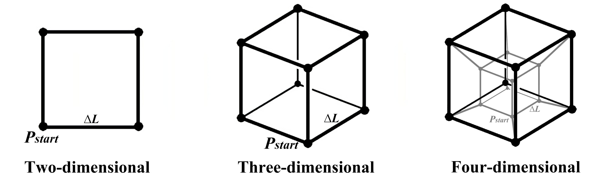
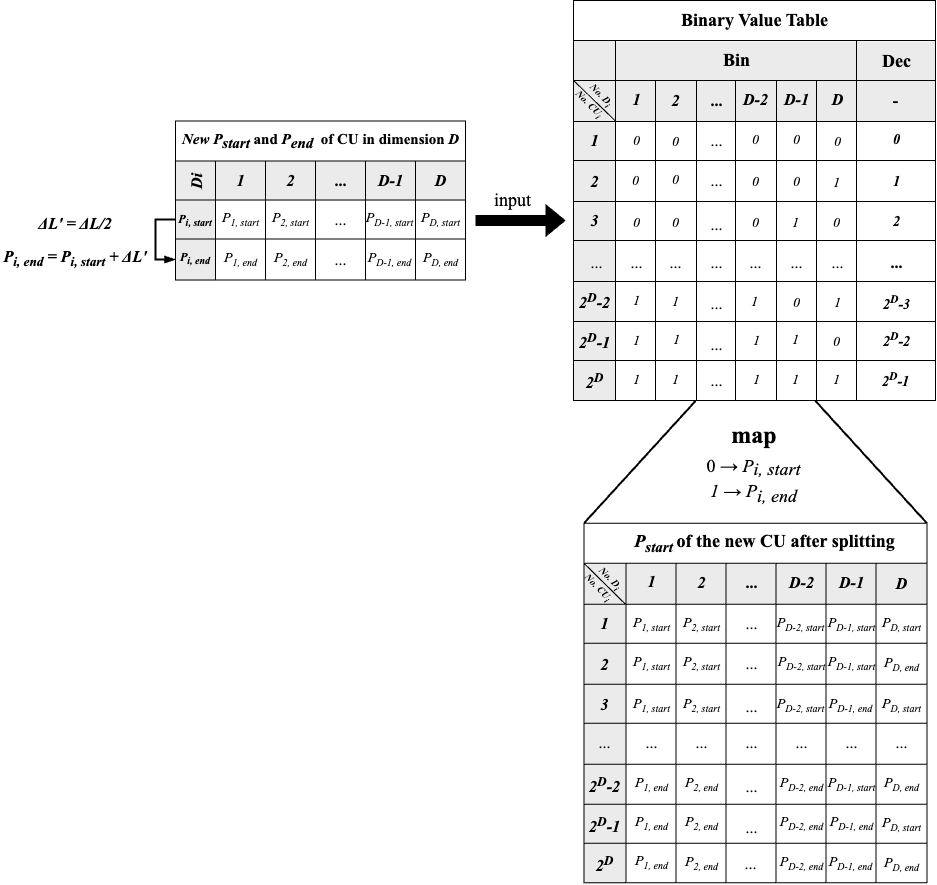
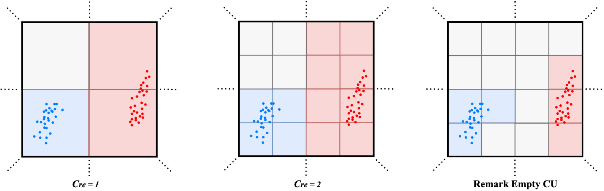
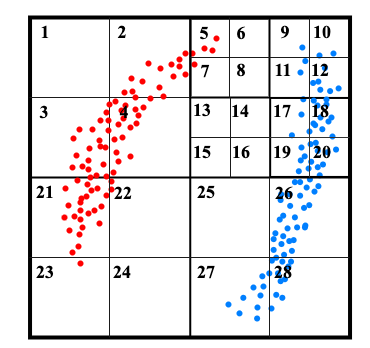
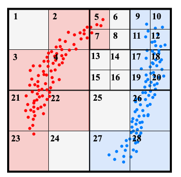
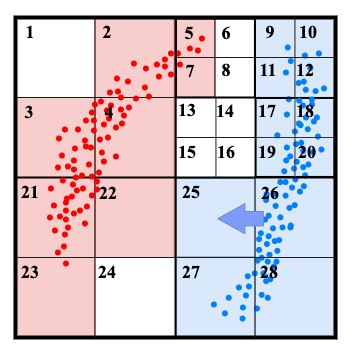
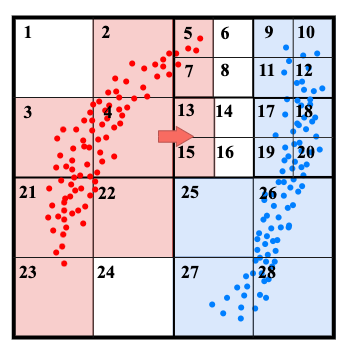
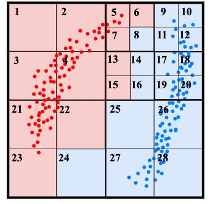

<div align="center">
  
  </br>
  <b><font size=3>Санкт-Петербургский государственный политехнический университет</font></b>
  </br>
  <b><font size=2>Институт компьютерных наук и технологий</font></b>
  </br>
  <b><font size=2>Высшая школа программной инженерии</font></b>
</div>


</br>
</br>
</br>
</br>

<div align="center">
<p align="center"><b><font size=12>编码单元分类器</font></b></br></p>
</div>
</br>
</br>
</br>
</br>
</br>
</br>


| Выполнил студенты гр. 3530904/90102 | Мэн Ц.            |
| :---------------------------------- | ----------------- |
| Руководитель                        | Черноруцкий И. Г. |

</br>
</br>

<div align="center">
  <p align="center">Санкт-Петербург</p>
  <p align="center">2023</p>
</div>

<div align=left>

> 作者：孟嘉宁，圣彼得堡彼得大帝理工大学，计算机科学与技术学院
>
> Мэн Цзянин, Санкт-Петербургский политехнический университет Петра Великого, Институт компьютерных наук и технологий
>


<p align="center"><b><font size=6>摘要</font></b></br></p>

> 关键词：机器学习，分类算法，分类器，分类预测，监督学习，算法，编码单元

本文提出了一种新的算法——编码单元分类算法 (CUCL - Coding unit classification algorithm), 用于解决机器学习中的分类预测问题。该算法的灵感来自于**高效率视讯编码[^1-1]**（High Efficiency Video Coding，简称 HEVC，又称为H.265）中的[编码树单元](https://zh.wikipedia.org/wiki/編碼樹單元)(Coding Tree Unit, CTU)。

编码树单元是HEVC的基本编码单元。HEVC支援8x8到64×64像素的CTU大小。编码树单元取代了过往中使用的 16×16 像素[宏区块](https://zh.wikipedia.org/wiki/宏區塊)，编码树单元可使用 64×64 的大区块结构，且可以更好地将图片细分为可变大小尺寸。于初始时将图片划分为编码树单元，可以为64×64、32×32或16×16，而像素块尺寸提升通常会提高时编码的效率。

借助于编码树中编码单元的思想，我们开发了编码单元分类分类器（Coding unit classifier， CUC），此外我们还提出了一种新的方法，用于识别和消除数据集中的异常值。

在本项工作中，使用了scikit-learn库，开发语言为Python3，并使用PyCharm和Visual Studio Code作为开发环境。

*在最终结果中将对一些数据集进行实验研究*，以验证我们提出的算法的性能。我们在配备了 macOS13 平台的设备上进行了所有的实验研究，该平台采用64位操作系统，Apple M1 Pro 8 核心CPU，以及统一内存架构的16GB内存。


[toc]

# 简介

机器学习是人工智能的一个分支，其发展历程从以“推理”为重点，到以“知识”为重点，再到以“学习”为重点，并已成为一门多领域交叉学科，涵盖多门学科，如概率论、统计学、逼近论、凸分析、计算复杂性理论等。机器学习理论主要探讨让计算机自动“学习”的算法，即从数据中自动分析获得规律，并利用规律对未知数据进行预测的算法。[^1-2]机器学习已广泛应用于诸多领域，如数据挖掘、计算机视觉、自然语言处理、生物特征识别等。

根据不同的学习方式，机器学习可分为监督学习、无监督学习、半监督学习和增强学习。监督学习的训练集包括由人标注的输入和目标输出，常见的算法有回归分析和统计分类；无监督学习的训练集没有人为标注的结果，常见的算法有生成对抗网络（GAN）和聚类；半监督学习介于监督学习和无监督学习之间；增强学习机器为了达成目标，随着环境的变动，而逐步调整其行为，并评估每一个行动之后所到的回馈是正向的或负向的。


许多算法被提出用于解决机器学习中的分类预测问题，并取得了较好的结果（T.Cover, P.Hart, 1967[^1-3]; Harry Zhang, 2004[^1-4]; Kevin P. Murphy, 2006[^1-5]; Leo Breiman, 1984[^2-5]; Quinlan, J. R. 1986[^2-6]; Quinlan, J. R. 1993[^2-7]; Freund, Y., Mason, L. 1999[^2-9]; Tin Kam Ho, 1995[^2-11], Leo Breiman, 2001[^2-12]; David Cox, 1958[^2-22]; V.N. Vapnik，A.Y. Chervonenkis，C. Cortes等人, (1964)[^2-14]）。下一章将讨论其中的一些算法。


# 文献回顾

在介绍本文中提出的算法之前，我们将介绍以前为解决计机器学习分类预测方面所做的一些工作。

- 1967年，T.M.COVER和P.E.HART提出了kNN算法(k-NearestNeighbor, kNN)[^1-2]。其中k指的是某个样本的k个最近的邻居，也就是说每个样本都可以用它最接近的k个邻居来代表或预测。 kNN算法的核心思想是如果一个样本在特征空间中的k个最相邻的样本中的大多数属于某一个类别，则该样本也属于这个类别，并具有这个类别上样本的特性。该方法在确定分类决策上只依据最邻近的一个或者几个样本的类别来决定待分样本所属的类别。

    > https://bbs.huaweicloud.com/blogs/251434
    
    

- 在（Harry Zhang, 2004[^1-3]; Kevin P. Murphy, 2006[^1-4]）中提出了朴素贝叶斯分类器。该分类器模型会给问题实例分配用特征值表示的类标签，类标签取自有限集合。它不是训练这种分类器的单一算法，而是一系列基于相同原理的算法：所有朴素贝叶斯分类器都假定样本每个特征与其他特征都不相关。朴素贝叶斯自1950年代已广泛研究，在1960年代初就以另外一个名称引入到文本信息检索界中[^2-1]，并至今仍然是文本分类的一种热门方法，文本分类是以词频为特征判断文件所属类别或其他（如垃圾邮件、合法性、体育或政治等等）的问题。通过适当的预处理，它可以与这个领域更先进的方法（包括支持向量机）相竞争。它在自动医疗诊断中也有应用。

    
  
- 决策树 - 决策树是一类树模型的统称，其最早可以追溯到1948年左右，当时克劳德·香农介绍了信息论[^2-2]，这是决策树学习的理论基础之一。随后，1963年，Morgan和Sonquist开发出第一个回归树[^2-3]，他们提出了一种分析调查数据的方法，它不对交互影响施加任何限制，侧重于减少预测误差，顺序操作，并且不依赖于分类中的线性程度或解释变量的排列顺序，当时他们起名为交互检测（AID）模型。由于AID没有真正考虑到数据固有的抽样变异性，Messenger和Mandell在1972提出了THAID树以弥补这一缺陷，1980年，Gordon V. Kass开发出CHAID算法[^2-4]，这是AID和THAID程序的正式扩展。

    随后出现的是CART树——分类和回归树（简称CART）——是Leo Breiman引入的术语[^2-5]，指用来解决分类或回归预测建模问题的决策树算法。CART模型包括选择输入变量和那些变量上的分割点，直到创建出适当的树。使用贪婪算法（greedy algorithm）选择使用哪个输入变量和分割点，以使成本函数（cost function）最小化。

    1986年，Quinlan开发出ID3算法[^2-6]，并于随后几年提出了C4.5算法[^2-7]。之后为了提高它的运算效率，Loh和Shih于1997年开发出QUEST[^2-8]。

    1999年，Yoav Freund和Llew Mason提出AD-Tree[^2-9]，在此之前，决策树已经在正确率上取得了很不错的成就，但是当时的决策树在结构上依旧太大，而且不容易理解，所以AD-Tree在节点上做了改变。该算法不仅对数进行投票，也对决策节点进行投票。并且每个决策节点都是有语义信息的，支持图形化，使人更容易理解。

    目前流行的决策树算法包括ID3、CHAID、CART、QUEST和C4.5。

    决策树可以看成为一个if-then规则的集合，即由决策树的根节点到叶节点的每一条路径构建一条规则，路径上内部节点的特征对应着规则的条件，而叶节点的类对应于规则的结论。因此决策树就可以看作由条件if（内部节点）和满足条件下对应的规则then（边）组成。

    决策树的工作方式是以一种贪婪（greedy）的方式迭代式地将数据分成不同的子集。其中回归树（regression tree）的目的是最小化所有子集中的MSE（均方误差）或MAE（平均绝对误差）；而分类树（classification tree）则是对数据进行分割，以使得所得到的子集的熵或基尼不纯度（Gini impurity）最小。[^2-10]
    
    
    
- Tin Kam Ho 于 1995 年[^2-11]提出了随机森林。随后由Leo Breiman于2001年[^2-12]在一篇论文中提出了一种结合随机节点优化和bagging，利用类CART过程构建不相关树的森林的方法。此外，本文还结合了一些已知的、新颖的、构成了现代随机森林实践的基础成分，特别是

    1. 使用out-of-bag误差来代替泛化误差
    2. 通过排列度量变量的重要性

    随机森林也是集成学习方法的一种。在机器学习中，随机森林是一个包含多个决策树的分类器，并且其输出的类别是由个别树输出的类别的众数而定。RF 模型已被证明是小样本和高维数据的可靠预测器（Biau 和 Scornet，2016[^2-13]）。


- 逻辑回归分类器 (Logistic regression, LR) 是另一种基本方法,虽然名字中带有“回归”一次，但它是一个分类器而不是回归方法，最初由David Cox在1958年提出[^2-22]，它建立了一个Logistic模型（也被称为Logit模型）。它最显著的优点是，它既可以用于分类，也可以用于类别概率估计，因为它与对数数据分布相联系。它采取线性组合的特征，并对其应用非线性的sigmoid函数。在逻辑回归的基本版本中，输出变量是二进制的，然而，它可以扩展到多个类别（那么它被称为多进制逻辑回归(multinomial logistic regression)）。二元逻辑模型将样本分为两类，而多指标逻辑模型则将其扩展为任意数量的类，而不对其进行排序。[^2-23]

    

- 支持向量机（Support Vector Machine, SVM）被V.N. Vapnik，A.Y. Chervonenkis，C. Cortes 等人于 1964 年[^2-14]提出，1964年，Vapnik和Alexey Y. Chervonenkis对广义肖像算法进行了进一步讨论并建立了硬边距的线性SVM[^2-15]。此后在二十世纪70-80年代，随着模式识别中最大边距决策边界的理论研究[^2-16]、基于松弛变量（slack variable）的规划问题求解技术的出现[^2-17]，和VC维（Vapnik-Chervonenkis dimension, VC dimension）的提出[^2-18]，SVM被逐步理论化并成为统计学习理论的一部分。1992年，Bernhard E. Boser、Isabelle M. Guyon和Vapnik通过核方法得到了非线性SVM[^2-19]。1995年，Corinna Cortes和Vapnik提出了软边距的非线性SVM并将其应用于手写字符识别问题 [^2-20]。

    SVM 是一类按监督学习方式对数据进行二元分类的广义线性分类器（generalized linear classifier），其决策边界是对学习样本求解的最大边距超平面（maximum-margin hyperplane）[^2-21]。SVM 使用铰链损失函数（hinge loss）计算经验风险（empirical risk）并在求解系统中加入了正则化项以优化结构风险（structural risk），是一个具有稀疏性和稳健性的分类器。SVM可以通过核方法（kernel method）进行非线性分类，是常见的核学习（kernel learning）方法之一。


# 所提出的方法

## 模型中使用的变量和参数

| **变量/参数** | **定义**                                                  |
| ------------- | --------------------------------------------------------- |
| $x$           | 数据集中的当前样本点                                      |
| $x^{\prime}$  | 数据预处理后的当前样本点                                  |
| $y$           | 样本点或编码单元的目标值（target）                        |
| $x_{min}$     | 为该特征值对应维度中的最小值                              |
| $x_{max}$     | 为该特征值对应维度中的最大值                              |
| $I_{min}$     | 数据预处理阶段，数据映射到的最小值                        |
| $I_{max}$     | 数据预处理阶段，数据映射到的最大值                        |
| $N_i$         | 数据集中的第 i 个样本（数据集的第 i 行）                  |
| $D_i$         | 数据集中的第 i 个维度（数据集的第 i 列）                  |
| $\Delta L$    | 编码单元的边长                                            |
| $P_{start}$   | 编码单元的起始点                                          |
| $P_{end}$     | 编码单元的结束点                                          |
| $p$           | 编码单元内，占比最高的某种样本点的比例                    |
| $t$           | 超参数：预分割阶段判断是否应该暂停分割的阈值（threshold） |
| $C_{re}$      | 超参数：编码单元进行细化分割的次数                        |
| $ρ$           | 编码单元的感染力度                                        |
| $V$           | 编码单元的容积                                            |


## 数据预处理

在数据集中，我们将一行数据称为一个样本点或者一个粒子，而数据集中除目标值的某一列被称为某一维度 $D_{i}$。

得到特征抽取后的数据集后，我们需要对其中的数据进行预处理。在本文提出的分类器 CUC 中，引入数据预处理是为了方便后续数据可视化，并消除当数据集维度过大时可能导致的计算数据溢出。通常情况下，我们可以使用归一化和标准化两种方法。这两种方法也是大多数机器学习算法中常用的数据预处理方法。

### 归一化

在归一化中,我们将特征抽取之后的数据进行变换，把数据映射到固定区间$[I_{min}, I_{max}]$之内。归一化的在数学上表述如下：
$$
x^{\prime}={\frac{x-x_{min}}{x_{max}-x_{min}}} \cdot {(I_{max}-I_{min})}+I_{min}
$$
其中，

- $x$ - 为数据集中的当前元素
- $x_{min}$ - 为该特征值对应维度中的最小值
- $x_{max}$ - 为该特征值对应维度中的最大值
- $I_{min}$ - 指定区间值的最小值
- $I_{max}$ - 指定区间值的最大值

进行归一化的优点是未改变数据分布的形状，但缺点是如果出现缺失值或者异常值（最大值和最小值是一个非常大的数），归一化会非常收到异常点的影响。所以这种方法的鲁棒性较差。

### 标准化

> https://www.zhihu.com/question/46500878

标准化（Standardization），也被称为Z值归一化（Z-Score Normalization），其作用是将每一维特征都调整为均值为0，方差为1。如果数据集中的数据比较嘈杂，我们建议使用标准化来进行特征预处理，标准化后数据集中每个维度的特征都具有相似的尺度和平均值，使得在数据处理中更加稳定和统一。标准化的数学表示如下：

首先计算均值与方差
$$
\begin{aligned}

\mu & =\frac{1}{N} \sum_{n=1}^N x \\

\sigma^2 & =\frac{1}{N} \sum_{n=1}^N\left(x-\mu\right)^2

\end{aligned}
$$
然后将特征 $x$ 减去均值，并除以标准差，得到新的特征值 $x^{\prime}$
$$
x^{\prime}=\frac{x-\mu}{\sigma}
$$
标准差 $\sigma$ 不能为零，否则说明这一维的特征没有任何区分性。

其中，

- $x$ - 为数据集中的当前元素
- $\mu$ - 该特征值对应维度的平均值
- $\sigma$ - 该特征值对应维度标准差

## 编码单元

在本节中我们将介绍编码单元的性质。

编码单元（Coding unit, CU）为编码单元分类器 CUC 的最基本单位，其在空间中的形态由数据集中的维度数量 $D$ 决定，CU 可以视为一个在 $D$ 维空间下的超立方体（hypercube）。在二维的空间下，编码单元表现为正方形；在三维空间下，编码单元表现为立方体；在四维及更高维度的空间下，编码单元表现为超立方体。下图展示了在不同维度空间下空间下，编码单元的形态。



编码单元具有两个重要性质：起始点（$P_{start}$）和边长 （$\Delta L$）。在任何维度 $D_{i}$ 下，单个编码单元的边长都相等，并且边在该维度下与坐标轴平行。这使得我们仅通过编码单元的 $P_{start}$ 和 $\Delta L$ 便可以确定它的体积和在空间中所有顶点的位置。

对于在 $D$ 维空间下的一个编码单元 $CU$，它的容积 $V$ 可以通过下面的公式计算：
$$
V = {\Delta L}^{D}
$$
对于编码单元在维度 $D_i$ 下的结束点 $P_{i,\ end}$，我们可以通过一下公式确定：
$$
P_{i,\ end} = P_{i,\ start} + \Delta L
$$
在 $D$ 维数据集下，对于某个编码单元 $CU$ 和数据集中的一个点 $x_i$，如果在所有维度 $D_j$ 下，满足 $P_{j,\ start}<x_{i,\ j}<P_{j,\ end}$，则可以判断该点属于此编码单元，否则不属于。
$$
\left\{\begin{array}{}
x \in  CU,\ if \ P_{start}<x<P_{end}  \\
x \not\in  CU,\ otherwise
\end{array}\right.
$$
如果一个编码单元中不包含任何点，我们将其称之为空白编码单元（$CU_{EMPTY}$）。

## 构建编码单元

在本章节，我们将介绍构建编码单元的方法。构建最终的编码单元主要涉及两个阶段：“分割”和“感染”，其中“分割”又分为“预分割”和“细化分割”。


### 分割

在这一小节中，我们将详细介绍编码单元的分割方法。下图展示了一个二维编码单元被分割，并不断的再对其右上角编码单元分割的过程。


而在下图中，展示了一个被均匀分割（即对后续产生的小编码单元也再进行分割）了 3 次的编码单元。


可以看出，在分割的过程中，单个编码单元的容积$V$和其中包含的粒子数量逐渐减少，其效果类似于一个不断递归的正方形。

在分割过程中：

- 每进行一次分割，编码单元的边长将变为原来的 $1/2$。所以对于一个由 $n$ 次分割得到的编码单元，其边长 ${\Delta L}^{\prime}$ 可由以下公式确定
    $$
    {\Delta L}^{\prime} = \Delta L /{2^{n}}
    $$
    
- 对于 $D$ 维的编码单元，进行一次分割后，它将被更小的 $2^D$ 个编码单元所替代。所以对于一个被均匀分割（均匀分割即对后续产生的小编码单元也再进行分割）了 $n$ 次的编码单元，其产生的小编码单元数量可由以下公式确定：
    $$
    number\ CU\ after\ n\ splits = 2^{nD}
    $$

- 对于一个由 $n$ 次分割得到的编码单元，在某一维度上起始点和结束点 $(P_{start}, P_{end})$ 的数学表述如下：
    $$
    (P_{start}, P_{end}) = (I_{min}+\frac{I_{max}-I_{min}}{2^{n}} \cdot k,\ I_{min}+\frac{I_{max}-I_{min}}{2^{n}} \cdot {(k+1)}), \qquad
     k=0\ or\ 1\ \ or\ ...\ or\ 2_{n}-1
    $$

为了确定在 $D$ 维空间下编码单元 $CU$ 在经过一次分割后，产生的所有新编码单元顶点在空间中的位置，我们可以构建一个“二进制数值表”（Binary Value Table 或 Bit table），其大小为 $[{2^D},\ D]$，其中每一行对应一个 $D$ 位二进制数，其取值范围为 ${[0, 2^{D-1}]}$。然后将其每个维度 $D_{i}$ 上的新 $P_{i,\ start}$ 和 $P_{i,\ end}$ 映射（map）到对应的二进制位上。下图中展示了其构建过程和方法。



#### 预分割

> /Users/fox/雪狸的文件/【资料】学习中/【优质-完整】机器学习讲义/机器学习(算法篇1).pdf
>
> 避免分类器过多的强调了训练集的准 确率甚至于对一些错误/异常的数据也进行了学习，而正确的数据却无法覆盖整个特征空间。为此，这样得到的分类器 在对新数据进行预测时将会出现错误。这种现象称之为过拟合，同时也是维灾难的直接体现。

本阶段将介绍编码单元的预分割原则。

在开始时，数据集中的所有样本点都包含在一个大的编码单元中。在“预分割”阶段，需要将初始的编码单元分割为更小的单元，直到满足其中一个条件：

- 编码单元中不存在任何样本点

- 在当前编码单元中，占比最高的某种样本点的比例 $p$ 大于等于指定的阈值 $t$（threshold）。

    这里，阈值 $t$ 是作为编码单元分类器 CUC 的超参数出现的，在初始化 CUC 估计器时，用户需要指定具体值，并且 $0 \leq t \leq 1$。通过判断 $t \leq p$ 的目的是为了避免过拟合（overfitting），减少数据集中的异常值对 CUC 分类性能的影响。
    
    在编码单元内，占比最高的某种样本点的比例 $p$，可以用以下公式计算：
    $$
    p = \frac{在CU中占比最多的某种样本点的数量}{此CU中所有样本点的数量}
    $$

在预分割结束后，

- 不包含任何样本点的编码单元我们将其目标值 $y_{CU}$ 设置为空白编码单元（$CU_{EMPTY}$），
- 将包含有样本点的编码单元的目标值 $y_{CU}$ 设置为与该单元中最大占比样本点的目标值 $y_x$ 相同。

预分割的主要步骤如算法1所示：

```pascal
INPUT: 初始编码单元的 $P_{start}$, $\Delta L$

FOR 所有没有目标值$y_{CU_{i}}$ 的 $CU_{i}$
 	IF(当前编码单元中不存在任何样本点):
 		$y_{CU_{i}} = CU_{EMPTY}$
 		BREAK
 		
  IF($t \leq p$:)
  	$y_{CU_{i}} = y_x$
  	BREAK
  	
  继续分割 CU_{i} 为更小的 CU，记录产生的新 CU 的 $P_{start}$ 和 $\Delta L$
  	
```


#### 细化分割（refinement split）

细化分割是在预分割基础上所进行的，其目的是为了提高后期预测的准确率，避免在后期“感染”过大的编码单元时造成欠拟合（underfitting）。细化分割的次数 $C_{re}$ 是作为编码单元分类器 CUC 的超参数出现的，具体次数应该由用户指定。细化分割的具体步骤如下：

1. 对已经预分割结束后获得的所有单元进行 $C_{re}$ 次均匀分割

2. 由于经过 $C_{re}$ 次均匀分割后产生了更小的编码单元，其中可能会产生新的不包含任何样本点的空白编码单元，这些新产生的空白编码单元的目标值被重新标记为 $CU_{EMPTY}$。

    下图中展示了一个当细化分割次数 $C_{re}=1$ 和 $C_{re}=2$ 时对某个编码单元的效果。可以看到，当经过 2 次均匀分割后，产生了新的不包含任何样本点的空白编码单元，因此我们需要对其进行重新标注。

    

细化分割的主要步骤如算法2所示：

```
INPUT: 预分割结束后产生的所有 CU

对预分割结束后产生的所有 CU在进行 $C_{re}$ 次均匀分割

FOR every new CU:
	IF (这个 CU 中没有样本):
		$y_{CU_{i}} = CU_{EMPTY}$
```


### 示例

假设我们拥有一个包含红色和蓝色两种目标值的二维数据集，他们在数据预处理后的分布如下图所示：


CUC 中的超参数：

| 超参数   | 值   |
| -------- | ---- |
| $t$      | 0.99 |
| $C_{re}$ | 1    |

**预分割：**

1. 首先我们要构建一个和数据映射区间 $[I_{min}, I_{max}]$ 相同大小的编码单元，这个编码单元包含了数据集中的所有样本点。如下图所示：

    

2. 经过第一次分割后，根据编码单元预分割原则：

    - 第 1、3、4 号编码单元中所有样本点所对应的目标值唯一（$p_{1, 3, 4} \geq t$），因此我们将 $y_{CU1, 3, 4} = y_{x\ in \ CU_{1, 3, 4}}$
    - 而 2 号编码单元中占比最多的蓝色样本点的 $p_{2} < t$，所以我们需要其进行进一步的分割

    第一次分割后的效果如下图所示：

    

3. 经过第二次分割后，我们可以看到，原本编号为 2 的编码单元被分割成了更小的4、5、6、7号编码单元。第二次分割后的效果如下图所示：

    

    并且此时每个编码单元都满足 $p_{i} \geq t$ 或者不包含任何粒子，预分割阶段结束。


**细化分割阶段：**

5. 细化分割的次数指定为了 $C_{re}=1$，所以经过一次均匀分割后后，效果如下图所示：

    

6. 最终，我们将新产生的空白编码单元的目标值被重新标记为 $CU_{EMPTY}$。

    

至此，分割阶段结束。开始感染阶段。


### 感染

> 流行病学 https://doi.org/10.1016/B978-0-323-90385-1.00004-2
>
> 最终，在“感染”阶段，那些空白编码单元将会通过计算被编码为目标值的一种，以用于分类器后续的预测。

在本阶段，将介绍感染的原理和方法。

该阶段的原理是根据病毒传播学和流行病学[^gr-1]中的 SIR 模型[^gr-2]（S，I，R 分别代表易感者、感染者和康复者的数量）。当族群中存在某种可传播性病毒时，该病毒在某族群中传染的力度 $ρ$ 由该族群中感染者的数量 $N_{I}^{SIR}$ 和区域的面积 $A$ 共同决定。
$$
ρ = \frac{N_{I}^{SIR}}{A}
$$
编码单元分类器的感染阶段就是受 SIR 模型的启发，我们可以将每个具有样本点的编码单元视为一个族群，并且与编码单元目标值相同的样本点的数量即为感染者的数量 $N_{I}^{SIR}$ ，而编码单元的容积 $V$ 即为 SIR 模型中族群所在的区域面积 $A$。在“分割”阶段后，每个编码单元的感染力度可以用以下公式表示：
$$
ρ = \frac{N_{I}^{SIR}}{\Delta L /{2^{n}}}=\frac{N_{I}^{SIR}}{V}
$$
由公式可知，如果某个编码单元的传染力度 $ρ$ 为 0，则说明其内部没有任何粒子存在（即空白编码单元），如上面图片中编号为 1、6、8、13 等单元。感染的目的就是将这些空白编码单元标记为数据集中目标值的某一种。

在计算出所有编码单元的传染力度 $ρ$ 后，感染阶段开始。

1. 拥有最大感染力度且没有感染过其他编码单元的编码单元（感染者， S），应当去感染其临近编码单元（被感染者，I）

    - 如果相邻的编码单元为空白编码单元，则将其感染为相同目标值，并执行步骤2
    - 如果相邻的编码单元具有相同目标值，则直接执行步骤2。
    - 如果相邻的编码单元具有不同目标值，则它们无法被感染，不会改变其目标值

2. 感染相邻编码单元之后，它们可以被视为一个融合在一起的，经过扩张的编码单元。经过扩张的编码单元，容积增大，感染力度下降。数学上的表述如下：
    $$
    ρ^{\prime}=\frac{\sum_{i=1}^n {N_{I}^{SIR}}}{\sum_{i=1}^n V}
    $$
    其中，$n$ - 为本次感染中感染者和被感染者的数量

3. 重复第一步，直到所有的编码单元都被感染。


感染阶段的主要步骤如算法3所示：

```
INPUT: 分割阶段后的所有 CU

WHILE (仍有未被感染的CU):
	感染者 = 拥有最大感染力度且没有感染过其他编码单元的编码单元
	感染者感染其临近的编码单元：
		IF (相邻的编码单元为空白编码单元):
			则将其感染为相同目标值，并标记为并感染者
    ELSE IF (相邻的编码单元具有相同目标值):
    	标记为并感染者
    ELSE IF (相邻的编码单元具有不同目标值):
    	不进行感染
    
	更新 感染者 和被感染者的 ρ
	
```


#### 示例

我们在分割阶段得到的结果的基础上进行，感染阶段的示例如下。

1. 通过计算可知，在 $ρ\neq0$ 的编码单元中，26 号的感染力度最大。所以应当去感染临近的 25 号编码单元

    

    

2. 之后，第二大 $ρ$ 的 4 号单元应当去感染 13 和 15 号。

    

3. 以此类推，得到最终的编码单元分类器

    

## 预测

对于一个输入CUC分类器中的新样本点，我们可以根据它所属编码单元的种类进行预测。比如在下图中展示了两个新粒子 $x_{new1}$ 和 $x_{new2}$，他们将会分别被预测为红色和蓝色。


感染阶段的主要步骤如算法4所示：

```
INPUT: 新的样本点

FOR CU_i 所有 CU 中:
	IF (新的样本点 x \in  CU_i):
		RETURN y_{CU_{i}}
```


# 数据集上的测试


# 结论


# 引用来源

[^1-1]:[Gary J. Sullivan, Woo-Jin Han, Thomas Wiegand, 2012. Overview of the High Efficiency Video Coding (HEVC) Standard , IEEE Transactions on circuits and systems for video technology, VOL.22, NO.12](https://iphome.hhi.de/wiegand/assets/pdfs/2012_12_IEEE-HEVC-Overview.pdf)
[^1-2]: [Machine Learning, wikipedia](https://zh.wikipedia.org/wiki/%E6%9C%BA%E5%99%A8%E5%AD%A6%E4%B9%A0)
[^1-3]:[T.Co ver and P. Hart (1967). "Nearest neighbor pattern classification" in IEEE Transactions on Information Theory, vol.13, no.1, pp.21-27, doi: 10.1109/TIT.1967.1053964.](https://ieeexplore.ieee.org/abstract/document/1053964)
[^1-4]:[Harry Zhang (2004). The Optimality of Naive Bayes](http://www.cs.unb.ca/~hzhang/publications/FLAIRS04ZhangH.pdf)
[^1-5]:[Kevin P. Murphy (2006). Naive Bayes classifiers](https://www.ic.unicamp.br/~rocha/teaching/2011s1/mc906/aulas/naive-bayes.pdf)

[^2-1]:Russell, Stuart; Norvig, Peter. Artificial Intelligence: A Modern Approach. 2nd. Prentice Hall. 2003 [1995]. ISBN 978-0137903955
[^2-2]:Shannon, C. E. (1949). Communication Theory of Secrecy Systems. Bell System Technical Journal 28 (4): 656–715.
[^2-3]:Morgan. J. N. & Sonquist, J. A. (1963) Problems in the Analysis of Survey Data, and a Proposal, Journal of the American Statistical Association, 58:302, 415-434.
[^2-4]:Gordon V. K. (1980).An  Exploratory Technique for Investigating Large Quantities of Categorical Data, Applied Statistics. 29(2): 119–127.
[^2-5]:Breiman, L.; Friedman, J. H., Olshen, R. A., & Stone, C. J. (1984). Classification and regression trees. Monterey, CA: Wadsworth & Brooks/Cole Advanced Books & Software.
[^2-6]:Quinlan, J. R. (1986). Induction of Decision Trees. Mach. Learn. 1(1): 81–106
[^2-7]:Quinlan, J. R. (1993). C4.5: Programs for machine learning. San Francisco,CA: Morgan Kaufman.
[^2-8]:Loh, W. Y., & Shih, Y. S. (1997). Split selection methods for classification trees. Statistica sinica, 815-840.
[^2-9]:Freund, Y., & Mason, L. (1999, June). The alternating decision tree learning algorithm. In icml (Vol. 99, pp. 124-133).
[^2-10]:[Mos Zhang, Yuanyuan Li (2022). Decision tree learning](https://www.jiqizhixin.com/graph/technologies/80fbc146-bc42-4585-93e3-21c2dd5ca63f).
[^2-11]:Tin Kam Ho. [Random decision forests](https://web.archive.org/web/20210303185509/https://ieeexplore.ieee.org/document/598994/). Proceedings of 3rd International Conference on Document Analysis and Recognition (Montreal, Que., Canada: IEEE Comput. Soc. Press). 1995, **1**: 278–282 [2020-03-04]. [ISBN 978-0-8186-7128-9](https://zh.m.wikipedia.org/wiki/Special:网络书源/978-0-8186-7128-9). [doi:10.1109/ICDAR.1995.598994](https://dx.doi.org/10.1109%2FICDAR.1995.598994).
[^2-12]:Leo Breiman (2001).  Random forests.
[^2-13]:Biau, G., Scornet, E. A (2016). random forest guided tour. *TEST* **25**, 197–227. https://doi.org/10.1007/s11749-016-0481-7
[^2-14]:Vapnik, V.N. and Lerner, A.Y., 1963. Recognition of patterns with help of generalized portraits. Avtomat. i Telemekh, 24(6), pp.774-780.
[^2-15]:Vapnik, V. and Chervonenkis, A., 1964. A note on class of perceptron. Automation and Remote Control, 24.
[^2-16]:Cover, T.M., 1965. Geometrical and statistical properties of systems of linear inequalities with applications in pattern recognition. IEEE transactions on electronic computers, (3), pp.326-334.
[^2-17]:Cover, T.M., 1965. Geometrical and statistical properties of systems of linear inequalities with applications in pattern recognition. IEEE transactions on electronic computers, (3), pp.326-334.
[^2-18]:Vapnik, V.N. and Chervonenkis, A.Y., 2015. On the uniform convergence of relative frequencies of events to their probabilities. In Measures of complexity (pp. 11-30). Springer, Cham.
[^2-19]:Boser, B.E., Guyon, I.M. and Vapnik, V.N., 1992, July. A training algorithm for optimal margin classifiers. In Proceedings of the fifth annual workshop on Computational learning theory (pp. 144-152). ACM.
[^2-20]:Cortes, C. and Vapnik, V., 1995. Support-vector networks. Machine learning, 20(3), pp.273-297.
[^2-21]:Li Hang．Statistical Learning Methods. Beijing: Tsinghua University Press, 2012: Chapter 7, pp. 95-135
[^2-22]:[Cox, D.R. (1958) The Regression Analysis of Binary Sequences. Journal of the Royal Statistical Society: Series B, 20, 215-242.](https://www.jstor.org/stable/2983890)
[^2-23]:[Stephanie Kay Ashenden (2021). The Era of Artificial Intelligence, Machine Learning, and Data Science in the Pharmaceutical Industry.](https://www.sciencedirect.com/book/9780128200452/the-era-of-artificial-intelligence-machine-learning-and-data-science-in-the-pharmaceutical-industry#book-info)

[^gr-1]:[Virus transmission and epidemiology (2023). Viruses (Second Edition), Understanding to Investigation, Pages 59-71](https://www.sciencedirect.com/science/book/9780323903851)

[^gr-2]:Hao Hu, Karima Nigmatulina, Philip Eckhoff, 2013. The scaling of contact rates with population density for the infectious disease models. [Mathematical Biosciences](https://www.sciencedirect.com/journal/mathematical-biosciences)[Volume 244, Issue 2](https://www.sciencedirect.com/journal/mathematical-biosciences/vol/244/issue/2), Pages 125-134


